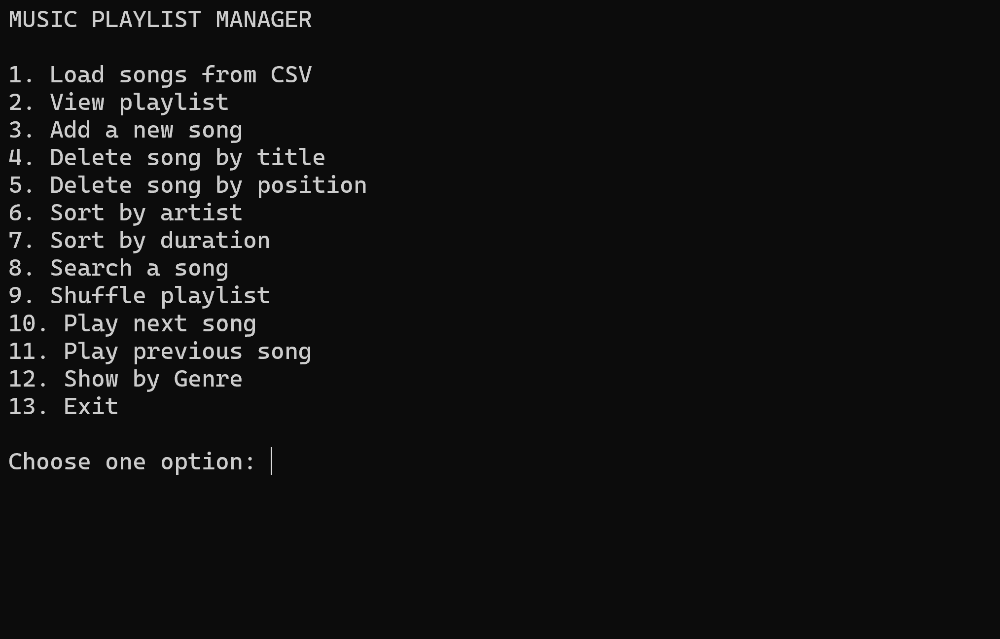

# 🎵 Music Playlist Manager (C# Linked List Project)

A console-based music playlist manager built in **C#** that demonstrates the use of a **custom singly linked list data structure** to manage songs.

This project was developed as part of a **Data Structures and Algorithms university assignment**.

---

## 🚀 Features

- Load songs from CSV file
- View playlist
- Add a new song
- Delete song by title
- Delete song by position
- Sort songs by artist
- Sort songs by duration
- Search for a song
- Shuffle playlist
- Play next / previous song
- Show songs by genre

---

## 🧠 Data Structure Used

The playlist is implemented using a **Singly Linked List**.

Each node contains:

- Title
- Artist
- Album
- Duration
- Genre
- Pointer to the next node

This structure allows efficient:
- insertion
- deletion
- sequential traversal of songs.

---

## 📋 Menu Example
MUSIC PLAYLIST MANAGER

1. Load songs from CSV
2. View playlist
3. Add a new song
4. Delete song by title
5. Delete song by position
6. Sort by artist
7. Sort by duration
8. Search a song
9. Shuffle playlist
10. Play next song
11. Play previous song
12. Show by Genre
13. Exit

Choose one option:

---

## ⚙️ Technologies Used

- C#
- .NET Console Application

---

## 📚 What I Learned

- Implementing linked lists from scratch
- Handling node insertion and deletion
- File parsing with CSV
- Algorithm design and problem solving
- Managing edge cases in data structures

## 🖥 Program Screenshot

Example output after loading songs and viewing the playlist:

## ▶️ How to Run

1. Clone the repository
2. Open the project in Visual Studio
3. Run the program
4. Select option **1** to load songs from the CSV file
5. Enter the file name:

songs_dataset.csv

6. After loading the songs, you can view and manage the playlist using the menu options.

The program loads songs from a CSV file and stores them using a custom singly linked list.

